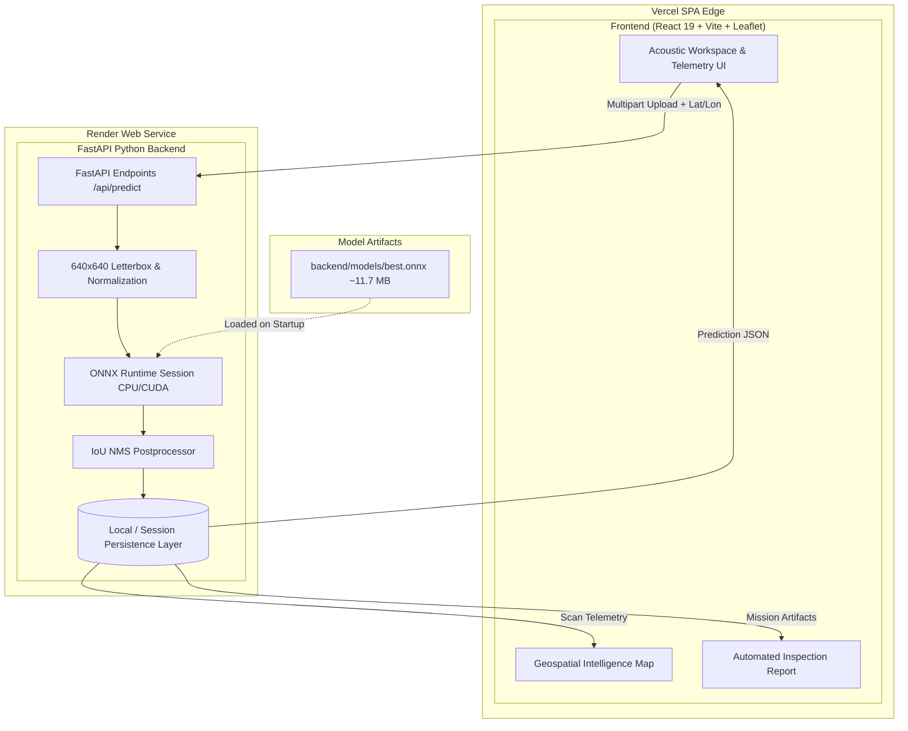

<div align="center">

# 🛰️ SONARX
### AI-Powered Side-Scan Sonar Intelligence Platform

[](https://fastapi.tiangolo.com)
[](https://onnxruntime.ai)
[](https://react.dev)
[](https://github.com/ultralytics/ultralytics)
[](https://render.com)

*Autonomous Seabed Target Classification for Naval Defense, Mine Countermeasures (MCM), and Marine Geophysical Surveying.*

---

</div>

## 📌 Executive Summary

**SONARX** is a production-quality side-scan sonar (SSS) analysis and intelligence prototype. It delivers automated, end-to-end target detection and classification for **MILCO** (Mine-Like Contacts) and **NOMBO** (Non-Mine Bottom Obstacles) from high-resolution acoustic backscatter imagery.

By pairing a specialized **YOLOv8n ONNX** neural network with a high-performance **FastAPI** backend and an interactive **React Geospatial UI**, SONARX replaces tedious manual acoustic waterfall inspection with instantaneous target bounding, confidence estimation, geospatial mapping, and automated naval inspection reports.

---

## 🌊 The Problem vs. The Solution

| Challenge in Traditional Sonar Operations | SONARX AI Solution |
| :--- | :--- |
| **Acoustic Clutter**: Seafloor sand ripples, boulders, and coral reefs cause high false-alarm rates. | **Dual-Class Discriminator**: Distinguishes dangerous MILCO hazards from benign NOMBO obstacles. |
| **Operator Fatigue**: Hours of reviewing monochrome waterfall scans degrades detection recall. | **Sub-10ms Inference**: Instantaneous acoustic target highlighting and tactical bounding box overlays. |
| **Fragmented Telemetry**: Sonar imagery is disconnected from geospatial coordinates and mission logs. | **Integrated Geospatial Canvas**: Interactive marine map linking detected contacts to GPS tracks. |
| **Slow Reporting**: Manual compilation of contact logs delays naval operational decisions. | **1-Click Intelligence Reports**: Exportable PDF/Print and JSON survey summaries ready for analysts. |

---

## 🏛️ System Architecture



---

## 🎯 Key Features

- **🔬 Precision Acoustic Inspection**: Drag-and-drop side-scan sonar imagery (JPG, PNG, WebP, TIFF) with instant pixel-accurate SVG bounding box rendering.
- **⚡ Ultralight ONNX Engine**: Powered by a custom-trained YOLOv8n model exported to ONNX for ultra-low latency inference (~9.8 ms on GPU, ~35 ms on standard CPU).
- **🧭 Geospatial Intelligence Map**: Real-time Leaflet map rendering survey tracks with tactical pulsing markers, contact popups, and coordinate filtering.
- **📊 Mission Analytics Dashboard**: Live KPI tracking for total survey tracks, MILCO hazards, NOMBO obstacles, mean confidence, and latency.
- **📑 Formal Naval Survey Reports**: Exportable one-click inspection reports with analyst narratives, contact registers, and JSON payloads.
- **🧪 Autonomous Demo Mode**: Built-in curated synthetic sonar tracks allowing immediate offline evaluation even without a connected GPU backend.

---

## 🧠 Machine Learning Model & Empirical Benchmarks

The core detection engine is a YOLOv8n network trained specifically on labeled side-scan sonar datasets with acoustic backscatter highlights and acoustic shadows.

### Baseline Model Specifications
- **Architecture**: YOLOv8 Nano (`yolov8n.pt` backbone fine-tuned)
- **Format**: ONNX Runtime (Opset 12)
- **Input Dimension**: `640 × 640 × 3` (Letterbox padded)
- **Weights Size**: ~11.7 MB (`backend/models/best.onnx`)
- **Target Classes**:
  - `MILCO` (Class 1) — Mine-Like Contact
  - `NOMBO` (Class 2) — Non-Mine Bottom Obstacle

### 📈 Current Baseline Validation Metrics
> *Note: These figures represent empirical validation performance on the benchmark validation split.*

| Metric | Overall Baseline | MILCO (Mine-Like) | NOMBO (Obstacle) |
| :--- | :---: | :---: | :---: |
| **Precision** | **71.8%** | 72.1% | 65.9% |
| **Recall** | **66.9%** | 73.8% | 41.4% |
| **mAP @ 0.50** | **71.2%** | **71.4%** | **54.2%** |
| **mAP @ 0.50:0.95** | **32.25%** | — | — |
| **Inference Benchmark** | **~9.8 ms / image** | *(Evaluated on NVIDIA T4 Tensor Core)* | |

---

## 🚀 Quickstart & Local Setup

### Prerequisites
- Python 3.10+ (tested on Python 3.11)
- Node.js 18+ & npm
- Git

### 1. Clone the Repository
```bash
git clone https://github.com/jayraj175coder/side_sonar_detection_ml.git
cd side_sonar_detection_ml
```

### 2. Backend Setup
```bash
# Navigate to backend
cd backend

# Install Python dependencies
pip install -r requirements.txt

# Place your trained best.onnx model
# File destination: backend/models/best.onnx

# Run backend tests
pytest tests/ -v

# Start FastAPI server
uvicorn app.main:app --host 0.0.0.0 --port 8000 --reload
```
*The backend API documentation is now live at `http://localhost:8000/docs`.*

### 3. Frontend Setup
```bash
# In a separate terminal, navigate to frontend
cd frontend

# Install Node dependencies
npm install

# Start Vite development server
npm run dev
```
*Access the SONARX dashboard at `http://localhost:5173`.*

---

## ⚙️ Environment Variables

### Backend (`backend/.env`)
```env
MODEL_PATH=./models/best.onnx
CONFIDENCE_THRESHOLD=0.25
CORS_ORIGINS=["http://localhost:5173","http://localhost:3000"]
HOST=0.0.0.0
PORT=8000
```

### Frontend (`frontend/.env`)
```env
VITE_API_URL=http://localhost:8000
```

---

## 📡 API Reference

| Method | Endpoint | Description |
| :--- | :--- | :--- |
| `GET` | `/health` | Service health and ONNX model loaded status |
| `GET` | `/api/model` | Model metadata, target classes, and baseline metrics |
| `POST` | `/api/predict` | Multipart upload for live ONNX sonar target detection |
| `GET` | `/api/scans` | Retrieve list of all processed survey tracks |
| `GET` | `/api/scans/{scan_id}` | Detailed telemetry and detections for a specific scan |
| `DELETE`| `/api/scans/{scan_id}` | Delete a scan record |
| `GET` | `/api/stats` | Aggregate metrics (total scans, class distribution, latency) |
| `GET` | `/api/scans/{scan_id}/report` | Structured naval inspection report data |

### Example Prediction Request & Response
```bash
curl -X POST "http://localhost:8000/api/predict" \
  -F "file=@sonar_track.png" \
  -F "confidence=0.25" \
  -F "latitude=17.6868" \
  -F "longitude=83.2185"
```

```json
{
  "scan_id": "SCAN-8841A9FC",
  "filename": "sonar_track.png",
  "image_width": 800,
  "image_height": 600,
  "inference_ms": 11.4,
  "created_at": "2026-08-26T10:15:30Z",
  "confidence_threshold": 0.25,
  "total_detections": 2,
  "milco_count": 1,
  "nombo_count": 1,
  "highest_confidence": 0.912,
  "status": "completed",
  "location": {
    "latitude": 17.6868,
    "longitude": 83.2185
  },
  "detections": [
    {
      "id": "det_1_a4f89c",
      "type": "MILCO",
      "confidence": 0.912,
      "bbox": {
        "x1": 240.0,
        "y1": 215.0,
        "x2": 375.0,
        "y2": 265.0
      }
    }
  ]
}
```

---

## 🚢 Cloud Deployment Guide

### Deploying Backend to Render
1. Create a **Web Service** on [Render](https://render.com).
2. Connect this repository and set `Root Directory` to `backend`.
3. Set **Build Command**: `pip install -r requirements.txt`.
4. Set **Start Command**: `uvicorn app.main:app --host 0.0.0.0 --port $PORT`.
5. Set Environment Variable: `MODEL_PATH=./models/best.onnx`.
6. Alternatively, use the included [`render.yaml`](./render.yaml).

### Deploying Frontend to Vercel
1. Import the repository on [Vercel](https://vercel.com).
2. Set **Root Directory** to `frontend`.
3. Framework Preset: **Vite**.
4. Configure Environment Variable: `VITE_API_URL=https://your-render-service.onrender.com`.
5. Deploy. (SPA routing is pre-configured via [`vercel.json`](./vercel.json)).

---

## 🔭 Prototype Capabilities & Roadmap

### Current Prototype Capabilities
- [x] Full real-time ONNX Runtime inference pipeline with YOLOv8n.
- [x] Accurate NMS bounding box extraction with IoU suppression.
- [x] Interactive maritime dashboard with dark technical aesthetics.
- [x] Leaflet geospatial intelligence map with track markers and popups.
- [x] Standalone Demo Mode with pre-calibrated benchmark acoustic tracks.
- [x] Exportable PDF/Print naval inspection reports and JSON output.

### Production Roadmap
- [ ] **PostgreSQL + PostGIS Integration**: Geospatial bounding box queries over survey polygons.
- [ ] **Native JSF/XTF Acoustic Parser**: Direct parsing of binary raw echosounder formats (EdgeTech, Klein).
- [ ] **Bathymetric Shadow Height Estimation**: Calculate contact elevation using acoustic shadow length and towfish altitude.
- [ ] **Edge AUV/UUV Deployment**: TensorRT optimization for subsea autonomous vehicles.

---

## 📄 License & Attribution
Developed for AI-powered maritime survey intelligence and competition prototyping. Licensed under the MIT License.
