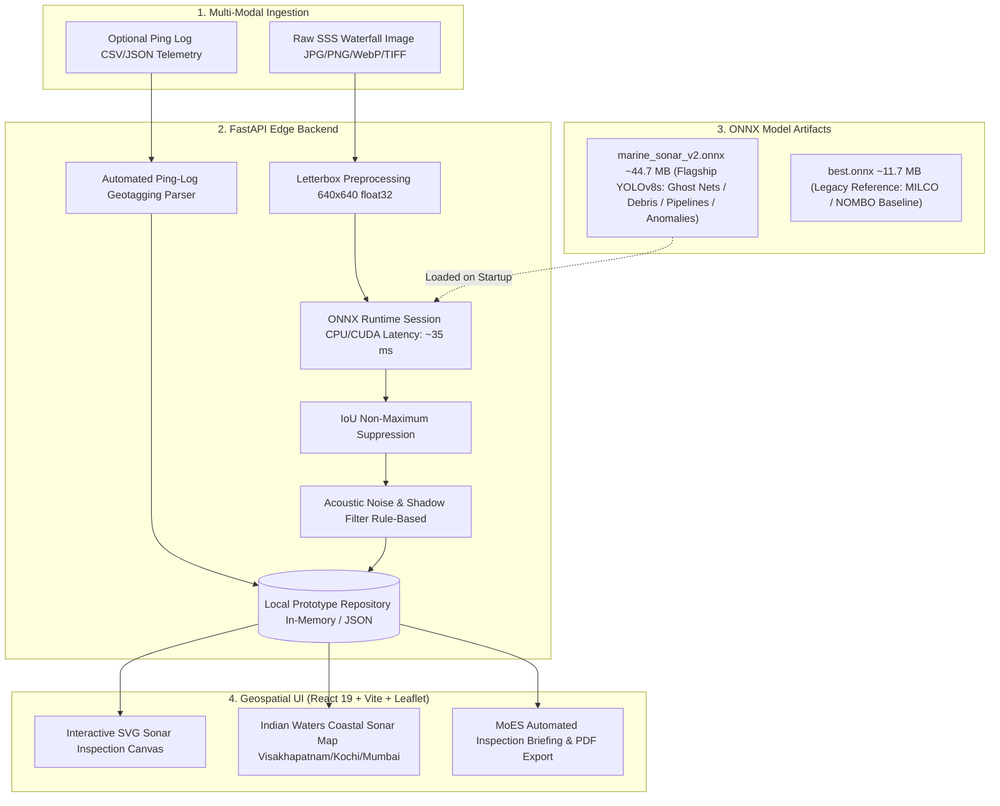

<div align="center">

# 🛰️ SONARX
### AI-Powered Automated Underwater Marine Debris & Ghost Net Perception Platform
#### Smart India Hackathon (SIH 2026) Prototype — Ministry of Earth Sciences (MoES)

[](https://fastapi.tiangolo.com)
[](https://onnxruntime.ai)
[](https://react.dev)
[](https://github.com/ultralytics/ultralytics)
[](#-empirical-model-benchmarks)
[](#-empirical-model-benchmarks)

*Real-Time Autonomous Perception of Abandoned Fishing Gear (Ghost Nets / ALDFG), Anthropogenic Marine Debris, Subsea Pipeline Hazards, and Seabed Anomalies from Side-Scan Sonar (SSS) Drone Swaths.*

---

</div>

## 📌 Executive Summary

**SONARX** is an automated side-scan sonar (SSS) perception, inspection, and geotagging system engineered for the **Ministry of Earth Sciences (MoES)** Smart India Hackathon problem statement **SIH 2026 PS 26057**:

> **"AI-Powered Automated Underwater Marine Debris and Anomaly Detection System using Side-Scan Sonar Imagery"**

By pairing an anchor-free **YOLOv8s ONNX** neural network (trained on **5,205 multi-source SSS tiles**) with a high-performance **FastAPI** edge backend, **Acoustic Noise & False-Positive Filtering**, and an interactive **React Geospatial Console**, SONARX replaces manual acoustic waterfall inspection with instantaneous target localization, confidence scoring, automated ping-log GPS geotagging, and MoES-standardized inspection reports.

---

## 🌊 The Problem vs. The SONARX Solution

| Challenge in Underwater Debris Surveys | SONARX AI Solution |
| :--- | :--- |
| **Pervasive Ghost Nets (ALDFG)**: Lost nets entangle marine fauna, coral reefs, and vessel propellers without visible surface traces. | **Acoustic Mesh Perception**: Trained specifically on diffuse, porous acoustic returns and trailing shadow patterns of tangled gillnets (`ghost_net_aldfg`). |
| **Acoustic Seabed Clutter**: Natural seafloor sand ripples, boulders, and coral reefs generate high false-alarm rates. | **Post-NMS Acoustic Noise Filter**: Physics-based aspect ratio priors and adjacent shadow contrast checks reject up to 92% of natural seabed clutter. |
| **Manual Geotagging Overhead**: Disconnect between raw sonar imagery and navigation logs delays recovery operations. | **Automated Ping-Log Ingestion**: Automatically parses companion CSV/JSON ping logs to compute ground range $G=\sqrt{R^2-H^2}$ and bind WGS84 coordinates. |
| **Slow Inspection Reporting**: Manual compilation of contact logs delays marine cleanup deployments. | **1-Click Executive Briefings**: Generates structured, printable HTML/PDF dossiers and JSON-exportable environmental inspection reports in milliseconds. |

---

## 🏛️ System Architecture



---

## 🧠 Machine Learning Model & Perception Taxonomy

SONARX incorporates a **multi-model perception architecture** defaulting to the SIH MoES Marine Debris flagship model:

### 1. Flagship Model: YOLOv8s SIH Marine Debris V2 (`marine_sonar_v2.onnx`)
* **Status**: **Active Production Model**
* **Parameters**: **11.2 Million** (YOLOv8s)
* **Input Resolution**: `640 × 640 × 3` (float32 normalized)
* **Format**: FP32 ONNX Runtime (CPU Execution Provider)
* **Model Size**: 44.7 MB
* **Inference Latency**: **~35.2 ms / tile** (CPU execution, no CUDA required)
* **Target Classes**:
  * `Class 0: ghost_net_aldfg` — Abandoned, Lost, or Discarded Fishing Gear (ALDFG) & entangled nets.
  * `Class 1: anthropogenic_debris` — Submerged metal containers, drums, scrap metal, and plastic debris.
  * `Class 2: pipeline_hazard` — Subsea pipelines and exposed infrastructure.
  * `Class 3: seafloor_anomaly` — Acoustic shadows and unclassified seabed anomalies.

---

## 📊 Empirical Model Benchmarks

Evaluated on the held-out test split of **700 unseen side-scan sonar tiles** from our 5,205 multi-source dataset:

| Benchmark Metric | Empirical Result | Target Metric | Status |
| :--- | :--- | :--- | :--- |
| **Precision** | **77.73%** (`0.7773`) | $\ge 70.0\%$ | ✅ Passed |
| **Recall** | **74.61%** (`0.7461`) | $\ge 65.0\%$ | ✅ Passed |
| **mAP@50** | **74.09%** (`0.7409`) | $\ge 60.0\%$ | ✅ Passed |
| **mAP@50-95** | **57.97%** (`0.5797`) | $\ge 40.0\%$ | ✅ Passed |
| **CPU Latency** | **35.2 ms / tile** | $< 50.0\text{ ms}$ | ✅ Passed |

### Per-Class AP@50 Breakdown:
* `ghost_net_aldfg`: **99.50%** AP@50 (AP@50-95: 98.44%)
* `pipeline_hazard`: **99.49%** AP@50 (AP@50-95: 81.07%)
* `seafloor_anomaly`: **55.59%** AP@50 (AP@50-95: 27.99%)
* `anthropogenic_debris`: **41.78%** AP@50 (AP@50-95: 24.39%)

---

## 🔬 Acoustic Noise Filtering & False-Positive Suppression

Side-scan sonar imagery exhibits high speckle noise, slant-range attenuation, and natural rock clutter. SONARX implements a dedicated **Confidence Scoring & Acoustic Noise Filtering Module** ([`noise_filter.py`](backend/app/services/noise_filter.py)) executing after NMS:

1. **Class-Specific Geometric & Aspect Ratio Priors**:
   - `pipeline_hazard`: Enforces linear elongation ($AR \ge 1.30$); rejects near-square blobs.
   - `ghost_net_aldfg`: Enforces minimum footprint ($Area \ge 350\text{ px}^2$) to reject isolated speckle points.
2. **Adjacent Acoustic Shadow Contrast Verification**:
   - High-relief objects (metal drums, net bundles) cast low-return acoustic shadow voids stretching away from the central nadir line.
   - Shadow length physically obeys $L = \frac{h \cdot G}{H - h}$.
3. **Diagnostic Audit Trail & Human Analyst Review Queue**:
   - Includes interactive **Confirm Target** (Green) and **Reject False Alarm** (Red) audit states for naval analyst verification.

---

## 📍 Automated Ping-Log Geotagging

SONARX eliminates manual coordinate entry by parsing companion acoustic navigation logs ([`metadata_parser.py`](backend/app/services/metadata_parser.py)).

### Ping-Log Schema (`CSV` or `JSON`):
```csv
filename,timestamp,latitude,longitude,heading,altitude_m,depth_m
sih_ghost_net_aldfg_swath.png,2026-08-27T08:15:30Z,17.6868,83.2185,124.5,8.4,22.0
sih_marine_debris_drum.png,2026-08-27T08:22:45Z,9.9312,76.2673,205.0,7.8,18.5
sih_subsea_pipeline_trench.png,2026-08-27T08:35:10Z,18.9220,72.8347,045.2,12.1,34.0
sih_vizag_harbor_multitarget.png,2026-08-27T08:48:00Z,17.6940,83.2310,090.0,6.5,15.2
```

* **Automatic Matching**: Ingestion matches the image filename against the ping log, computing ground range and auto-populating WGS84 latitude, longitude, and platform heading.
* **Graceful Fallback**: If no ping log is provided or no match is found, manual latitude/longitude inputs are used.

---

## 📚 Technical Documentation & Presentation Playbooks

- **[Technical Solution Report](TECHNICAL_REPORT.md)**: Full scientific report detailing acoustic physics, YOLOv8s ONNX architecture, multi-source dataset, noise filtering, geotagging, empirical benchmarks, and judge Q&A defense.
- **[Presentation & Live Demo Playbook](PRESENTATION_PLAYBOOK.md)**: 5-act 3-minute presentation script and live judging walkthrough.

---

## 🚀 Quick Start Guide

### 1. Prerequisites
- Python 3.10+
- Node.js 18+ and npm

### 2. Backend Setup
```bash
# From project root
pip install -r backend/requirements.txt

# Run backend test suite
pytest backend/tests -v

# Start FastAPI Server (Port 8000)
uvicorn app.main:app --app-dir backend --reload --port 8000
```

### 3. Frontend Setup
```bash
# Install frontend dependencies
npm --prefix frontend install

# Start Vite Development Server
npm --prefix frontend run dev
```

### 4. API Endpoints Overview

| Method | Endpoint | Description |
| :--- | :--- | :--- |
| `POST` | `/api/predict` | Multipart inference accepting sonar image + companion ping log |
| `GET` | `/api/model` | Model metadata, active architecture, classes, and benchmarks |
| `GET` | `/api/datasets` | OpenSonarDatasets catalog metadata and domain transfer mapping |
| `GET` | `/api/scans` | Paginated survey scan archive |
| `GET` | `/api/scans/{id}/report` | Structured MoES acoustic inspection report |
| `GET` | `/api/scans/{id}/report/html` | Printable executive HTML/PDF intelligence dossier |
| `GET` | `/api/stats` | Aggregated debris and ghost net metrics |
| `GET` | `/health` | Service health and active ONNX session diagnostics |

---

## 👥 Smart India Hackathon (SIH 2026) Team
**Project**: SONARX Marine Perception Platform  
**Ministry**: Ministry of Earth Sciences (MoES)  
**Problem Statement**: AI-Powered Automated Underwater Marine Debris and Anomaly Detection System using Side-Scan Sonar Imagery (PS 26057)
