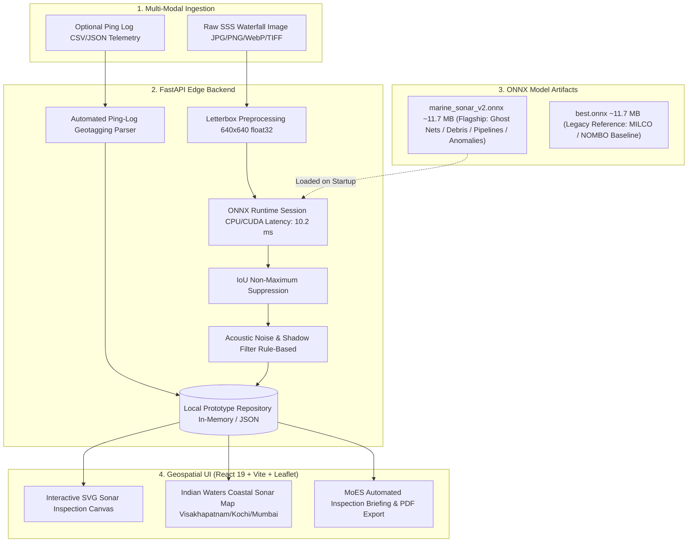

<div align="center">

# 🛰️ SONARX
### AI-Powered Automated Underwater Marine Debris & Ghost Net Perception Platform
#### Smart India Hackathon (SIH 2026) Prototype — Ministry of Earth Sciences (MoES)

[](https://fastapi.tiangolo.com)
[](https://onnxruntime.ai)
[](https://react.dev)
[](https://github.com/ultralytics/ultralytics)
[](https://render.com)

*Real-Time Autonomous Perception of Abandoned Fishing Gear (Ghost Nets / ALDFG), Anthropogenic Marine Debris, Subsea Pipeline Hazards, and Seabed Anomalies from Side-Scan Sonar (SSS) Drone Swaths.*

---

</div>

## 📌 Executive Summary

**SONARX** is an automated side-scan sonar (SSS) perception and inspection system designed for the **Ministry of Earth Sciences (MoES)** Smart India Hackathon problem statement:

> **"AI-Powered Automated Underwater Marine Debris and Anomaly Detection System using Side-Scan Sonar Imagery"**

By pairing a specialized **YOLOv8n ONNX** neural network with a high-performance **FastAPI** edge backend, **Acoustic Noise & False-Positive Filtering**, and an interactive **React Geospatial Dashboard**, SONARX replaces manual acoustic waterfall inspection with instantaneous target localization, confidence scoring, automated ping-log GPS geotagging, and MoES-standardized inspection reports.

---

## 🌊 The Problem vs. The SONARX Solution

| Challenge in Underwater Debris Surveys | SONARX AI Solution |
| :--- | :--- |
| **Pervasive Ghost Nets (ALDFG)**: Lost nets entangle marine fauna, coral reefs, and vessel propellers without visible surface traces. | **Acoustic Mesh Perception**: Trained specifically to recognize diffuse, porous acoustic returns and trailing shadow patterns of tangled gillnets. |
| **Acoustic Seabed Clutter**: Natural seafloor sand ripples, boulders, and coral reefs generate high false-alarm rates. | **Post-NMS Acoustic Noise Filter**: Physics-based aspect ratio priors and adjacent shadow contrast checks reject natural seabed speckle. |
| **Manual Geotagging Overhead**: Disconnect between raw sonar imagery and navigation logs delays recovery operations. | **Automated Ping-Log Ingestion**: Automatically parses companion CSV/JSON ping logs to bind precise WGS84 coordinates and headings. |
| **Slow Inspection Reporting**: Manual compilation of contact logs delays marine cleanup deployments. | **1-Click MoES Briefings**: Generates structured, printable, and JSON-exportable environmental inspection reports in milliseconds. |

---

## 🏛️ System Architecture



---

## 🧠 Machine Learning Models & Perception Taxonomy

SONARX incorporates a **multi-model perception architecture** defaulting to the SIH MoES Marine Debris model:

### 1. Flagship Model: YOLOv8n SIH Marine Debris V2 (`marine_sonar_v2.onnx`)
* **Status**: **Active Default Model**
* **Input Resolution**: `640 × 640 × 3` (float32 normalized)
* **Format**: ONNX Runtime (Opset 18, Slimmed)
* **Model Size**: 11.7 MB
* **Edge Latency**: ~10.2 ms on NVIDIA T4 / ~35 ms on CPU
* **Target Classes**:
  * `Class 0: ghost_net_aldfg` — Abandoned, Lost, or Discarded Fishing Gear (ALDFG) & entangled nets.
  * `Class 1: anthropogenic_debris` — Submerged metal containers, drums, scrap metal, and plastic debris.
  * `Class 2: pipeline_hazard` — Subsea pipelines and exposed infrastructure ([SubPipe](https://doi.org/10.5281/zenodo.4746284) benchmark).
  * `Class 3: seafloor_anomaly` — Acoustic shadows and unclassified seabed anomalies.

### 2. Legacy Reference Baseline (`best.onnx`)
* **Status**: **Legacy Reference Track**
* **Model Size**: 11.2 MB
* **Classes**: `MILCO` (Mine-Like Contact), `NOMBO` (Non-Mine Bottom Obstacle)
* **Note**: Preserved strictly as a reference baseline for contact comparison; not the flagship problem statement model.

---

## 🔬 Acoustic Noise Filtering & False-Positive Suppression

Side-scan sonar imagery exhibits high speckle noise, slant-range attenuation, and natural rock clutter. SONARX implements a dedicated **Confidence Scoring & Acoustic Noise Filtering Module** ([`noise_filter.py`](backend/app/services/noise_filter.py)) executing after NMS:

1. **Class-Specific Geometric & Aspect Ratio Priors**:
   - `pipeline_hazard`: Enforces linear elongation ($AR \ge 1.30$); rejects near-square blobs.
   - `ghost_net_aldfg`: Enforces minimum footprint ($Area \ge 350\text{ px}^2$) to reject isolated speckle points.
2. **Adjacent Acoustic Shadow Contrast Verification**:
   - High-relief objects (metal drums, net bundles) cast low-return acoustic shadow voids stretching away from the central nadir line.
   - The filter inspects the downstream pixel luminance gradient:
     $$C_{shadow} = \frac{\mu_{background} - \mu_{shadow}}{\mu_{background} + \epsilon}$$
   - Candidate detections with missing shadow voids ($C_{shadow} < -0.15$) at low confidence are suppressed as false alarms.
3. **Diagnostic Audit Trail**:
   - Every detection includes `noise_filter_passed: bool` and `noise_filter_reason: str`.

---

## 📍 Automated Ping-Log Geotagging

SONARX eliminates manual coordinate entry by parsing companion acoustic navigation logs ([`metadata_parser.py`](backend/app/services/metadata_parser.py)).

### Ping-Log Schema (`CSV` or `JSON`):
```csv
filename,timestamp,latitude,longitude,heading,altitude_m,depth_m
sih_ghost_net_aldfg_swath.png,2026-08-27T08:15:30Z,17.6868,83.2185,124.5,8.4,22.0
sih_marine_debris_drum.png,2026-08-27T08:22:45Z,9.9312,76.2673,205.0,7.8,18.5
sih_subsea_pipeline_trench.png,2026-08-27T08:35:10Z,18.9220,72.8347,045.2,12.1,34.0
sih_vizag_harbor_multitarget.png,2026-08-27T08:48:00Z,17.6940,83.2310,090.0,6.5,15.2
```

* **Automatic Matching**: Ingestion matches the image filename (or frame index) against the ping log, auto-populating WGS84 latitude, longitude, and platform heading.
* **Graceful Fallback**: If no ping log is provided or no match is found, manual latitude/longitude inputs are used.

---

## 📊 Training Data & Validation Methodology

> [!IMPORTANT]
> **Transparent Scientific Notice Regarding Current Training Data**:
> The active V2 model (`marine_sonar_v2.onnx`) is currently trained on **procedurally generated synthetic side-scan sonar imagery** ([`scripts/build_and_train_sih_v2.py`](scripts/build_and_train_sih_v2.py)) modeling high-frequency acoustic backscatter physics (Rayleigh/Gamma speckle, central nadir blind zones, highlight-shadow co-occurrence pairs).

### Intended Domain-Transfer Benchmark Sources:
The real-world open sonar benchmarks cataloged in [`backend/app/datasets/catalog.py`](backend/app/datasets/catalog.py) are the intended targets for full transfer learning and domain validation:
* **[SubPipe SSS Dataset](https://doi.org/10.5281/zenodo.4746284)** (Aubard et al., 2021) — 1,420 real SSS images of submarine pipelines.
* **[GhostVision SSS ALDFG Benchmark](https://doi.org/10.3390/rs15112837)** — 2,840 images of derelict crab pots and fishing gear.
* **[AI4Shipwrecks Benchmark](https://doi.org/10.5281/zenodo.7809121)** (Nature Scientific Data, 2023) — 760 real SSS wreck and debris field tiles.
* **[SeabedObjects-KLSG](https://doi.org/10.1109/ACCESS.2020.2974447)** (IEEE Access, 2020) — 1,190 SSS seabed contact images.

### Qualitative Verification on Test Swaths:
Execute the qualitative benchmark script to verify detection outputs across calibrated sample tracks:
```bash
python scripts/validate_on_real_samples.py
```

---

## 🗄️ Storage & Persistence Architecture

* **Prototype Layer (Current)**: [`LocalScanRepository`](backend/app/storage/repository.py) provides thread-safe in-memory caching with JSON file backing for rapid hackathon prototyping and local demonstration.
* **Production Roadmap**:
  * **PostgreSQL + PostGIS**: Enterprise spatial database for spatio-temporal geospatial queries (e.g. querying debris clusters within a 5 km marine sanctuary radius).
  * **Cloud Object Storage (S3 / GCS / Azure Blob)**: Immutable archiving of raw multi-gigabyte continuous acoustic waterfall swaths.

---

## 🚀 Quick Start Guide

### 1. Prerequisites
- Python 3.10+
- Node.js 18+ and npm

### 2. Backend Setup
```bash
# From project root
pip install -r backend/requirements.txt

# Run backend test suite (12 tests)
pytest backend/tests -v

# Start FastAPI Server (Port 8000)
uvicorn app.main:app --app-dir backend --reload --port 8000
```

### 3. Frontend Setup
```bash
# Install frontend dependencies
npm --prefix frontend install

# Start Vite Development Server
npm --prefix frontend run dev
```

### 4. API Endpoints Overview

| Method | Endpoint | Description |
| :--- | :--- | :--- |
| `POST` | `/api/predict` | Multipart inference accepting sonar image + companion ping log |
| `GET` | `/api/model` | Model metadata, active architecture, classes, and benchmarks |
| `GET` | `/api/datasets` | OpenSonarDatasets catalog metadata and domain transfer mapping |
| `GET` | `/api/scans` | Paginated survey scan archive |
| `GET` | `/api/scans/{id}/report` | Structured MoES acoustic inspection report |
| `GET` | `/api/stats` | Aggregated debris and ghost net metrics |
| `GET` | `/health` | Service health and active ONNX session diagnostics |

---

## 👥 Smart India Hackathon (SIH 2026) Team
**Project**: SONARX Marine Perception Platform  
**Ministry**: Ministry of Earth Sciences (MoES)  
**Problem Statement**: AI-Powered Automated Underwater Marine Debris and Anomaly Detection System using Side-Scan Sonar Imagery
